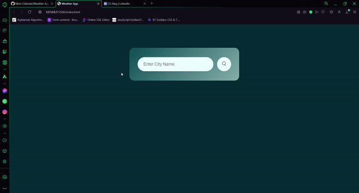

# 🌩Weather-App
 Weather web application that fetches real-time weather data using the OpenWeatherMap API. Built with HTML, CSS, and JavaScript, this app allows users to get current weather information for any city in the world.

# 🌪Features
- **Current Weather**: Displays temperature, humidity, wind speed, and weather conditions.
- **User Input**: Allows users to search for the weather in different cities.
- **Error Handling**: Handles errors gracefully, such as when a city is not found.

# 🌫Preview

# 👁‍🗨API
- [OpenWeatherMap API](https://openweathermap.org/api)
